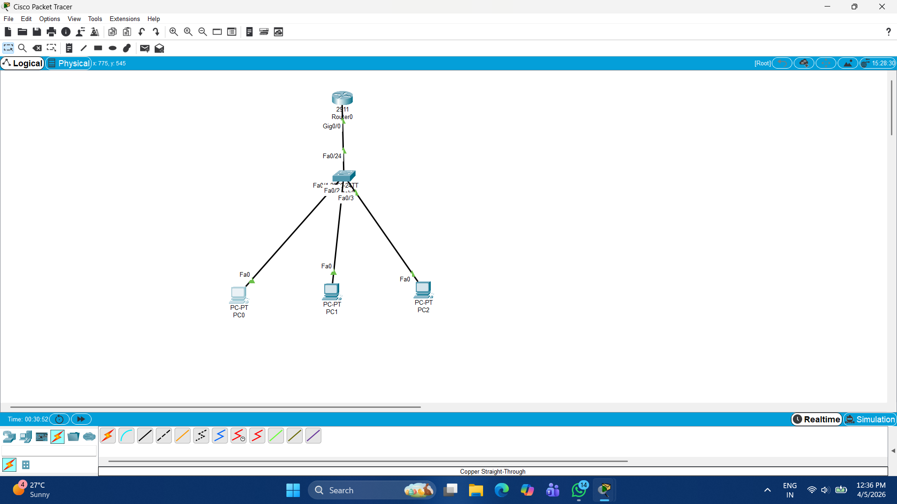
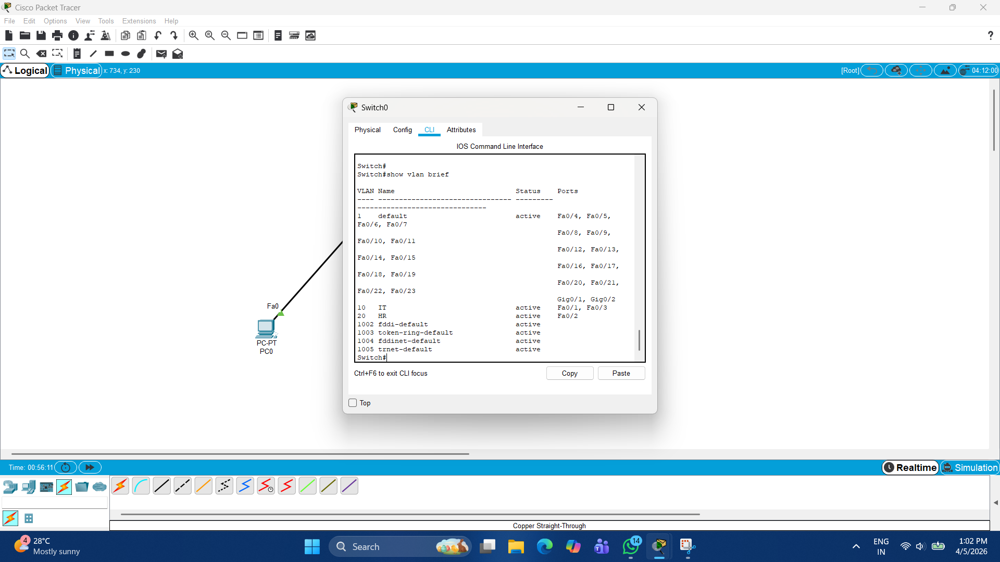
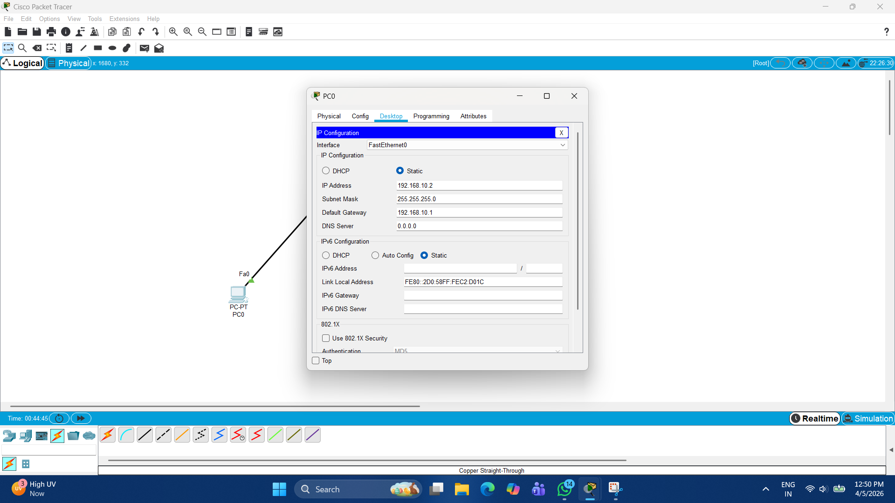
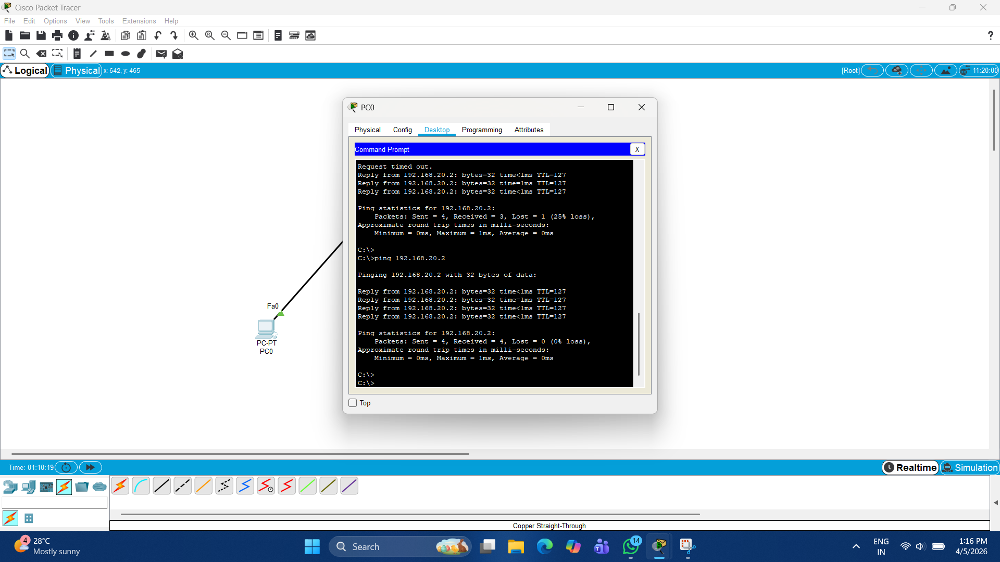

# Multi-VLAN Office Network Design (Packet Tracer)

## 📌 Overview
This project demonstrates VLAN segmentation and inter-VLAN routing using Router-on-a-Stick architecture in Cisco Packet Tracer.

## 🏗️ Network Design
- VLAN 10: IT Department (192.168.10.0/24)
- VLAN 20: HR Department (192.168.20.0/24)

## ⚙️ Configuration
- Created VLANs on switch
- Assigned ports to respective VLANs
- Configured trunk port between switch and router
- Implemented inter-VLAN routing using Router-on-a-Stick
- Assigned IP addresses to all PCs

## 🧪 Testing
- Verified connectivity using ping
- Successful communication between VLANs

## 📸 Project Screenshots

### 🔹 Network Topology

### 🔹 VLAN Configuration

### 🔹 Router Configuration

### 🔹 Connectivity Test (Ping)

## 🚀 Result
Successfully implemented inter-VLAN routing with proper communication between different departments.

## 👨‍💻 Author
Rahul Rajput
